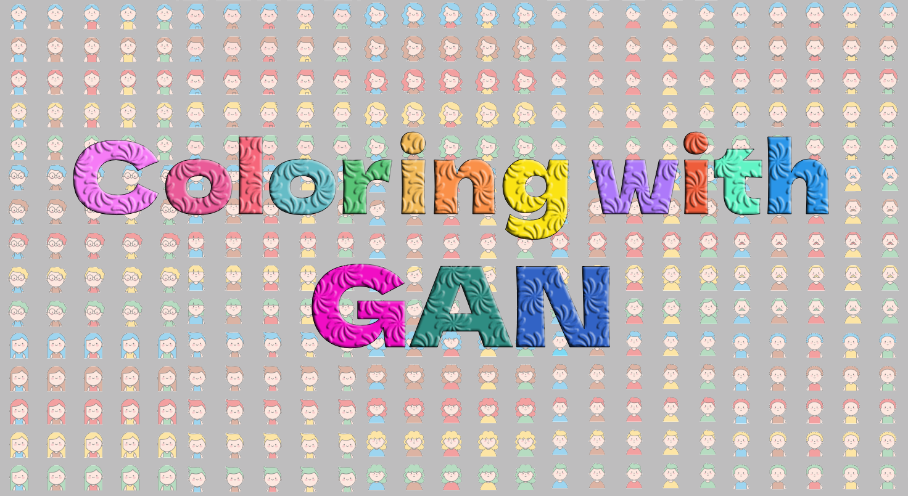

    
  </a>

<h1 align="center">Image-to-image translation with a conditional GAN</h1>

This repository demonstrates how to build and train a conditional generative adversarial network, designed to learn how to translate an input image into a corresponding output image.
 
 
  

      
  

 

The model learns a mapping from an observed input image (such as a sketch) and specific conditions (like shirt and hair color) to produce an output image (such as a colored image).

## Related Works
| Paper                                                                                                                                                                                | Code                                                                     |
|--------------------------------------------------------------------------------------------------------------------------------------------------------------------------------------|--------------------------------------------------------------------------|
| [Generative Adversarial Network](https://arxiv.org/pdf/1406.2661v1.pdf)                                                                                                              | [Link](https://github.com/goodfeli/adversarial)                          |
| [Conditional Generative Adversarial Nets](https://arxiv.org/pdf/1411.1784.pdf)                                                                                                       | [Link](https://github.com/znxlwm/pytorch-mnist-celeba-cgan-cdcgan)       |
| [Unsupervised Representation Learning with Deep Convolutional Generative Adversarial Networks](https://arxiv.org/pdf/1511.06434v2.pdf)                                               | [Link](https://pytorch.org/tutorials/beginner/dcgan_faces_tutorial.html) |
| [Image-to-Image Translation with Conditional Adversarial Networks](https://openaccess.thecvf.com/content_cvpr_2017/papers/Isola_Image-To-Image_Translation_With_CVPR_2017_paper.pdf) | [Link](https://github.com/phillipi/pix2pix?tab=readme-ov-file)           |

## Network architectures
* a generator with a modified UNet architecture:

  > In the encoder, each module consists of Convolution followed by Batch Normalization and Leaky ReLU activation. (Convolution -> Batch normalization -> Leaky ReLU)

  > In the decoder, the modules are made up of Transposed Convolution, Batch Normalization, Dropout (used in the first three modules), and ReLU activation. (Transposed convolution -> Batch normalization -> Dropout (applied to the first 3 blocks) -> ReLU)

  > There are skip connections that link the corresponding layers of the encoder and decoder

* a discriminator: 
  > Each module in the discriminator is: Convolution -> Batch normalization (BatchNorm is not applied to the first  module)-> Leaky ReLU

## Dataset
Files:
* **inputs:** input images
* **targets:** colored images
* **metadata.csv:**
  
Columns of metadata CSV file:
* **input:** image name
* **target:** image name
* **hair:** color name
* **shirt:** color name

**A visualization of 8 samples from a dataset:**

 
  

      
  

**Visualization of Generator’s Progression**
 
  

      
    </a>
  

 
 

* Learning Curves: Generator and Discriminator Loss in cGAN
   
  

      
  

* Result:

 This project demonstrates how a Conditional GAN (cGAN) can be used to colorize input images. The example below shows a comparison between a real image and the corresponding colorized output generated by the cGAN. 
 In the comparison, the left column shows the colorized output, while the right column displays the real image

 
  

      
  

